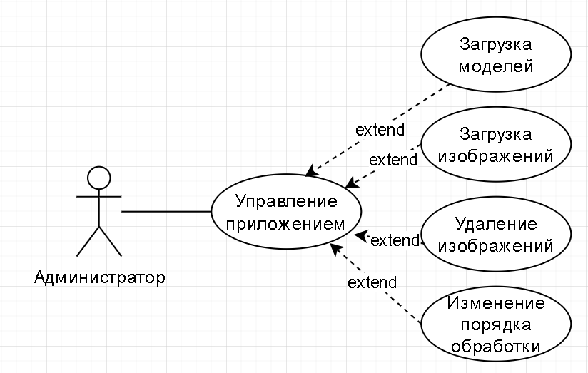
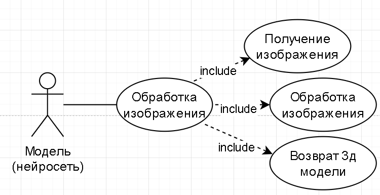
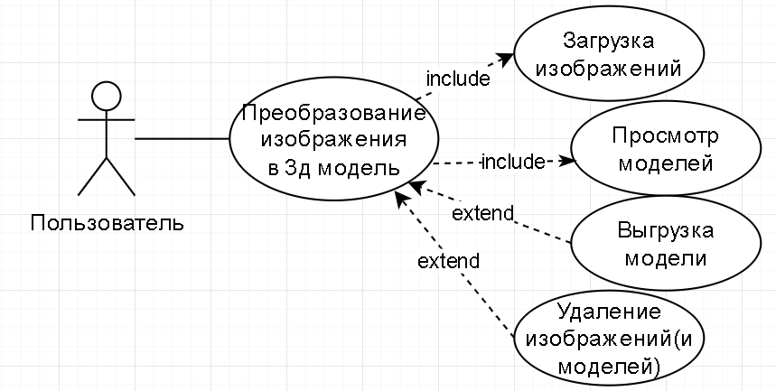
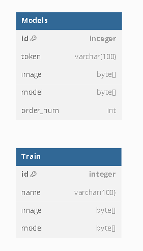

# Практика 0
**Тема:** Разработка модели для 3D оцифровки по фотографическим изображениям

## 1. Требования
Бизнес требование - нужна модель(нейросеть), которая будет преобразовывать изображение в 3д модель

1. Возможность загрузить фото (FullHD)
2. Преобразовать в 3д модель
3. Визуализировать 
4. Скачать (обязательно формат ptx)

## 2. Модель

### Ubiquitous language

1. Модель - нейросеть, которая осуществляет преобразование изображения в 3д модель
2. Очередь - REST API приложение, которое позволяет взаимодействовать с моделями, определять порядок обработки изображений и обеспечивать интеграцию
3. Приложение - одностраничное приложение, которое предоставляет пользователю интерфейс для взаимодействия с очередью

### Доп контекст
Для цифровизации реальных объектов используются дорогостоящие и сложные в обращении 3д сканеры (дешевле сфотографировать объект и поправить артефакты 3дмодели, чем сканировать его и всеравно править 3дмодель). Преобразование 2д в 3д имеет большой потенциал для дизайна, кино, геймдева (дешевле нарисовать и преобразовать чем моделировать с нуля, к тому же скетчи перед моделированием всеравно делают). 

## Инструментарий

Очередь:
- **ЯП** - Go 
- **IDE** - Visual studio 
Модель: 
- **ЯП** - Python 
- **IDE** - Google Colab

## Прецеденты

## Модель данных
На уровне хранения - у API своя база (Models), у моделей - своя(Train), выступающая для обучения

## Пояснение
Еще не дошел до этапа, когда прописал бы общение моделей и API, но идея такова, что модели получают изображения из API, и загружают в него 3д модели, после чего 3дмодель должна отобразиться у пользователя в приложении. На данный момент у меня есть почти готовое API и уже порядочно обученная нейросеть, но ей еще надо прописать процесс общения с API.

**Исходный код**  
[Все что есть]([\src\MLWebApi](https://github.com/Runedragon-dev/dist_sys/tree/main/src/MLWebApi))
[REST API]([src\MLWebApi\rest\rest.go](https://github.com/Runedragon-dev/dist_sys/tree/main/src/MLWebApi/rest/rest.go))
[REST API тесты]([src\MLWebApi\rest\rest.go](https://github.com/Runedragon-dev/dist_sys/tree/main/src/MLWebApi/rest/rest_test.go))
