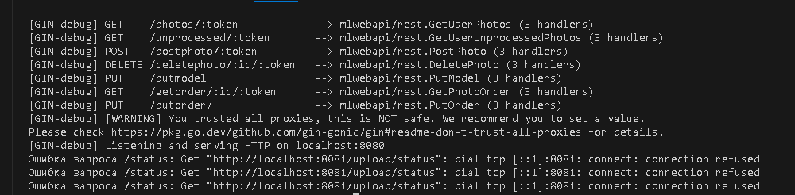

# Практика 1
**Тема:** Разработка модели для 3D оцифровки по фотографическим изображениям

Слои:
Application - модуль rest - Api приложение
Domain - Api с нейросетью которая обработает изображение
Infrastructure - модуль datamodel 

Добавил механизм опроса и рассылки фото по моделям в модуле rest.
Сделал прототип api для самих нейросетей. 
Написал Dockerfile для обоих api, протестировал основной контейнер (rest api).

Соединение не устанавливается потому что второй контейнер еще не готов.

На всякий случай напомню механизм. Пользователь будет взаимодействовать с одностраничным приложением, оно будет взаимодействовать (передавать изображения) rest api приложению, которое будет рассылать их по развернутым моделям нейросетей для обработки. Т.е. будет три вида контейнеров - одностраничное приложение, rest api и нейросеть, причем последние могут использоваться во множественном количестве.

Насколько я понимаю вызовы в go уже асинхронны.
