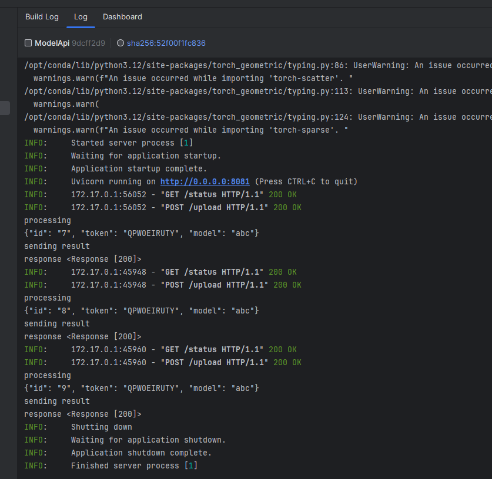
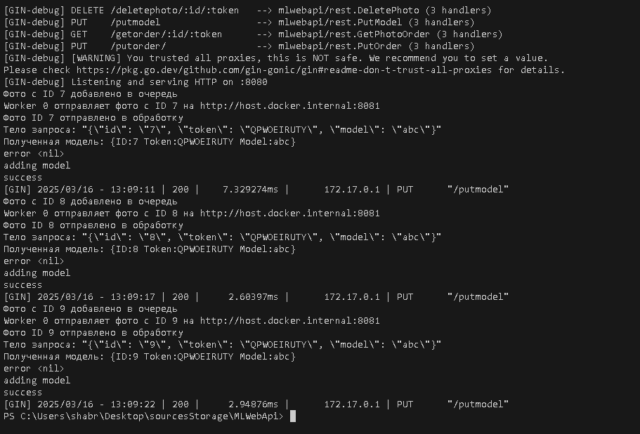

# Практика 2
**Тема:** Разработка модели для 3D оцифровки по фотографическим изображениям

Слои:
Application - модуль rest - Api приложение
Domain - Api с нейросетью которая обработает изображение
Infrastructure - модуль datamodel 

1. Дописал API на Python 
2. Доработал [api](https://github.com/Runedragon-dev/dist_sys/tree/main/src/ModelAPI)  для самих нейросетей. Сама модель весит 9гб, поэтому на гитхаб, увы не влезет.
3. Доработал [Dockerfile](https://github.com/Runedragon-dev/dist_sys/blob/main/src/MLWebApi/Dockerfile) для обоих api.
4. Протестировал взаимодействие обоих API

На всякий случай напомню механизм. Пользователь будет взаимодействовать с одностраничным приложением, оно будет взаимодействовать (передавать изображения) rest api приложению, которое будет рассылать их по развернутым моделям нейросетей для обработки. Т.е. будет три вида контейнеров - одностраничное приложение, rest api и нейросеть, причем последние могут использоваться во множественном количестве.

Насколько я понимаю вызовы в go уже асинхронны.

CQRS не подходит, поскольку в текущем виде базы данных, это будет явным переусложением.
