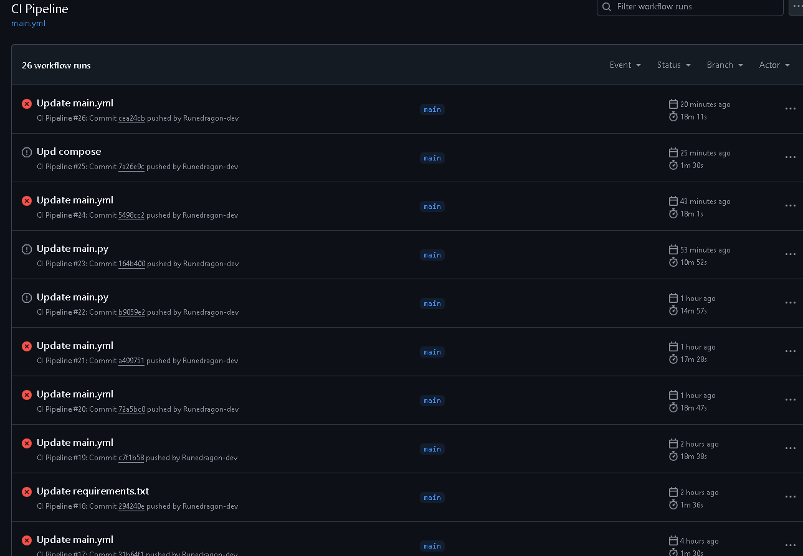

# Практика 3
**Тема:** Разработка модели для 3D оцифровки по фотографическим изображениям
На всякий случай напомню механизм. Пользователь будет взаимодействовать с одностраничным приложением, оно будет взаимодействовать (передавать изображения) rest api приложению, которое будет рассылать их по развернутым моделям нейросетей для обработки. Т.е. будет три вида контейнеров - одностраничное приложение, rest api и нейросеть, причем последние могут использоваться во множественном количестве.

Показывать в этой практике особо ничего не получается, т.к. для реализации балансировщика мне придется переделывать собственный, как оказалось велосипедный недокод, где я пытался сам изобрести round robin алгоритм для своей задачи.

По крайней мере я попытался реализовать [CI]([https://github.com/Runedragon-dev/dist_sys/blob/main/src/ModelAPI/docker-compose.yml](https://github.com/Runedragon-dev/dist_sys/blob/main/.github/workflows/main.yml)), который и для ПАПСа собственно реализовать тоже не смог.
Честно говоря, в отличие от многих я первый раз сел работ с cicd дальше запуска тестиков и сломался об этот ужас, не представляю как люди делают это для больших проектов, а что у них в голове вообще страшно представить. 

Как балансировщики существуют я вообще не представлял, вообще, у меня сложилось такое впечатление, что это какое то сакральное знание, которое все обсуждают, но в косвенном ключе. Тысячи слов об особенностях и вариантах, но ни одного о том, как это просто взять и применить. 
Это оказалось достаточно интересно в отличие от CI, если бы я вообще знал, что можно его так применять (я набросал репликацию контейнера в [контейнер модели](https://github.com/Runedragon-dev/dist_sys/blob/main/src/ModelAPI/docker-compose.yml) ),
но применить ее в рабочем виде невозможно из за моего текущего велосипеда - придется переделывать все, а на такое времени у меня нет.
Появился даже интерес сделать по-настоящему распределенную систему, но и практически полезные реализуемые идеи сейчас найти невозможно и выгорел от вышки я настолько, что хочу просто на несколько месяцев глухой лес отдыхать.
Насколько понимаю, эта практика последняя и хочу сказать то, что понял уже после прохождения сопа, что для меня этот курс, хоть и в преимущественно одностороннем порядке, но стал некоторым проблеском света и показал вещи, к которым я, прокляв себя работой bi аналитика и не притронулся бы, а как оказалось, стоило бы.
